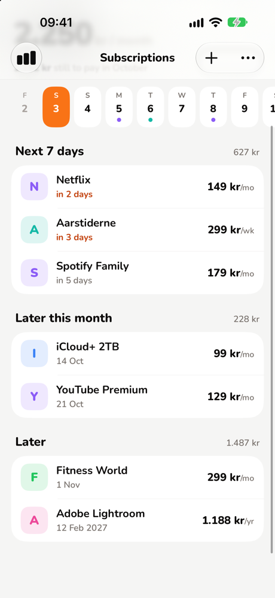
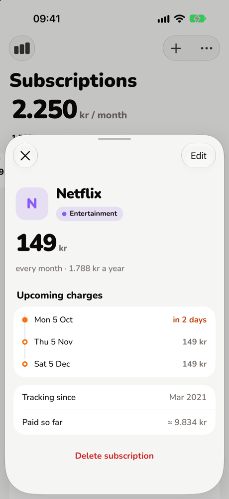
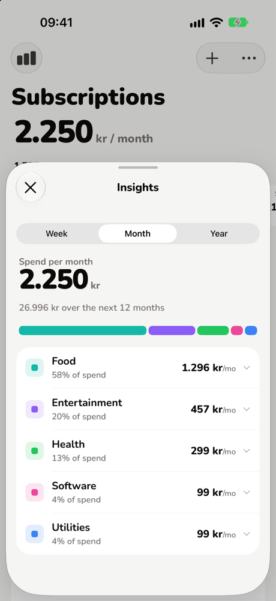
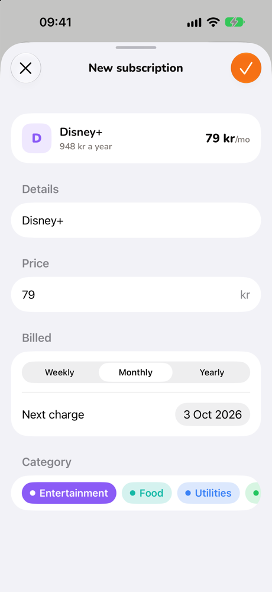

# Subscriptions manager

## Preview

  
  
  
  

## Description

This is a simple subscriptions tracker application. It allows you to add, categorize, edit and delete subscriptions. You can also see the total amount of money you spend on subscriptions per month and category.

## Technical information

This application is hosted on Vercel and is powered by supabase to handle storing and Auth. CRUD operations are handled through server actions.

## Angular Native experiment

`apps/ng-native` is the same native app rebuilt with [Angular Native](https://ng-native.com) (Angular on React Native's Fabric renderer), sharing the Supabase backend and `packages/shared`.
